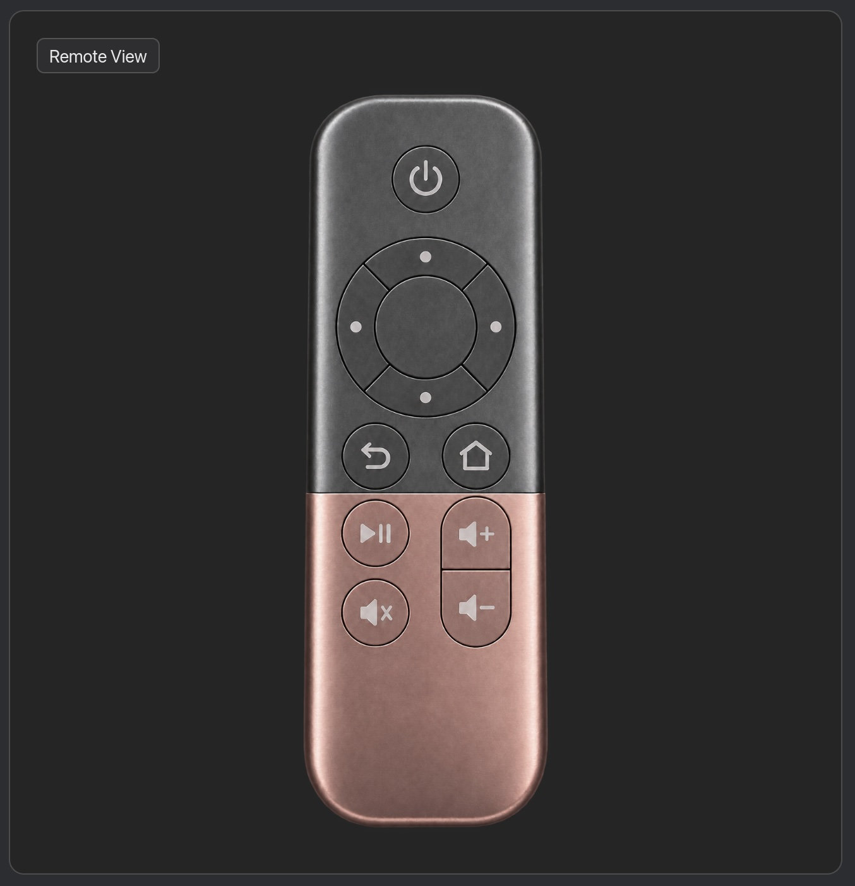
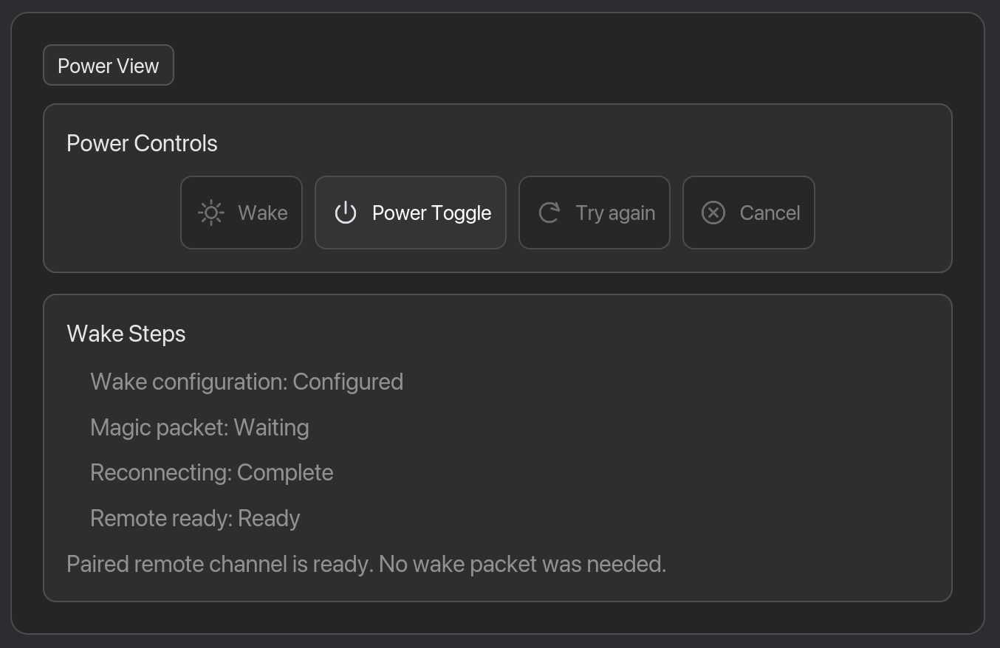

# Samsung TV Remote

> Super-fast remote controller for macOS, written in Rust.

Save time controlling your Samsung TV from your Mac. It is built for the
moments when powering on your own Samsung TV through the official SmartThings
app feels slower than reaching for a remote.

The app supports discovery or manual address entry, certificate checking,
TV-approved pairing, saved-TV reconnect, remote keys, and Wake-on-LAN. Power,
Remote, and Settings are functional.

Release: [v1.0.0](docs/releases/v1.0.0.md).

 

See the [documentation index](docs/README.md) for current guidance
and archived plans.

For setup, development, and validation, use the
[contribution guide](docs/contribution-guide.md). Do not commit pairing tokens,
TV addresses, or local-network captures.
